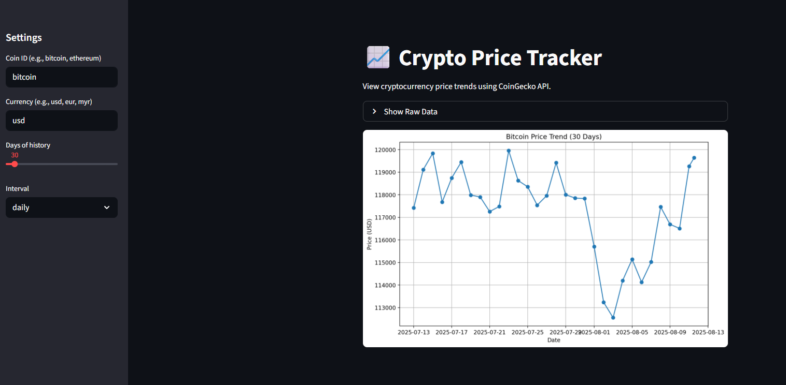

# 📊 Data Science Mini Projects – Netflix Analysis & CoinGecko Tracker

This repository contains two beginner level projects aimed at practicing **data analysis**, **data visualization**, and **API integration** skills using Python.

---

## **1️⃣ Netflix Dataset Analysis**

**🎯 Goal:** Perform exploratory data analysis (EDA) on a Netflix dataset to uncover insights about content trends, genres, and ratings.

### **Steps**
1. **Data Cleaning**
   - Handle missing values
   - Convert dates to `datetime` objects
   - Remove duplicates
2. **Exploratory Analysis**
   - Count content types (Movies vs TV Shows)
   - Find most common genres
   - Identify content release trends by year
3. **Visualization**
   - Bar plots, pie charts, and time series charts using Matplotlib/Seaborn

### **Example Insights**
- 📈 Netflix’s library growth over the years  
- 🌍 Countries with the most content  
- 🎭 Most common genres in recent years  

### **Tools Used**
- **Pandas** – Data cleaning & manipulation  
- **Matplotlib / Seaborn** – Visualizations  
- **Jupyter Notebook** – Interactive analysis  

📂 **Folder:** `/netflix_analysis/`  
📄 **File:** `netflix_analysis.ipynb`

---

## **2️⃣ CoinGecko API Tracker**

**🎯 Goal:** Fetch cryptocurrency price data using the **CoinGecko API** and display it in a **Streamlit dashboard**.

### **Features**
- Search for any cryptocurrency by its ID (e.g., `bitcoin`, `ethereum`)
- Display:
  - 💵 Current price in USD
  - 📉 24-hour price change percentage
  - 📊 Market capitalization
- Visualize historical price trends (optional)

### **Steps**
1. **API Call**
   - Use `requests` to fetch JSON data from [CoinGecko API](https://www.coingecko.com/en/api)
2. **Data Parsing**
   - Extract required fields from the response
3. **Visualization**
   - Create a simple dashboard with **Streamlit**

### **Tools Used**
- **Requests** – API data fetching  
- **Streamlit** – Interactive UI  
- **Pandas** – Data formatting  

📂 **Folder:** `/coingecko_tracker/`  
📄 **File:** `coingecko_app.py`

---

## 🖼️ Example Outputs

### Netflix Analysis

### CoinGecko Tracker

---

